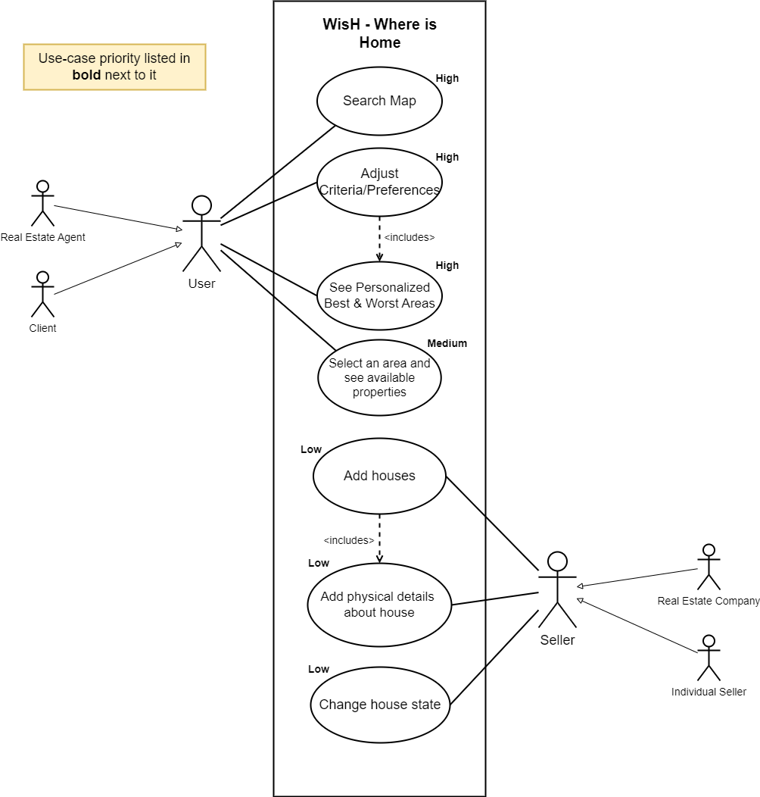
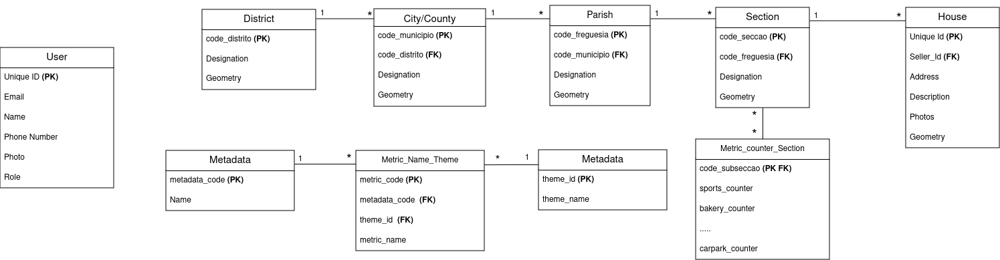
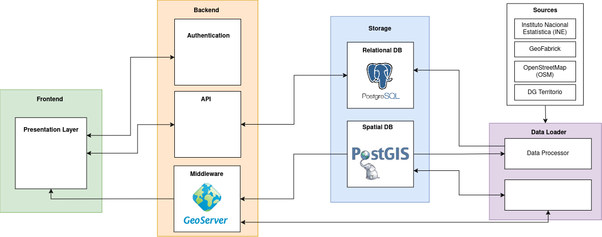
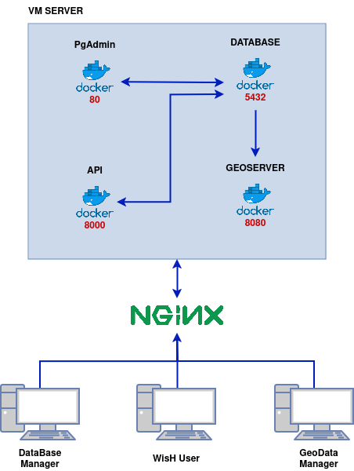

<h1> WisH <small>Where is Home</small></h1>

## About our project

### Context and motivation
 

The real estate sector is constantly evolving and requires more and better solutions for finding properties.

Currently, real estate search platforms are opting for a more traditional solution, focusing only on the physical characteristics of the property, without considering the factors related to the area where the property is located. This factor is extremely important to the client and can be the deciding factor in the final selection of the property.

Lack of familiarity with the area can make it difficult to assess the quality of life, convenience, and suitability of the area for your particular needs. This can lead to less informed buying decisions and possibly dissatisfaction with your property choice.

 

### What is WisH?
 
**WisH: Where is Home** is an innovative and personalized real estate research platform, instead of focusing only on the physical characteristics of properties, it takes into account the individual preferences of buyers, allowing them to explore areas of interest based on metrics relevant additional information, example Walk Score, Transit Score...

 

### Objectives

- The main objective of **WisH** is to provide a personalized and innovative real estate research platform, which allows users to explore areas of interest based on metrics relevant to their lifestyle, such as Walk Score, Transit Score, and others, allowing the customers to find the best place to live according to their preferences.

- Provide a platform to real state agents to promote their properties, and to reach potential customers, based on their preferences.

 

## Functional Requirements

### List of Features

#### Customer Account
- **Login/Register Process:** Allows customers to create and log in to their account.
- **Manage Account Details:** Customers can update their personal information as needed.
- **Manage Personal Preferences:** Enables customers to set preferences such as metrics and aspects of importance to them.

#### Seller Account
- **Login/Register Process:** Allows sellers to create and log in to their account.
- **List Properties for Sale:** Sellers can list their properties on the platform.
- **Add Property Details:** Enables sellers to provide details about their properties.
- **Upload Photos and Videos:** Sellers can upload visual content for their properties.

#### Customer Interaction
- **Interact/Filter Using Evaluation Metrics:** Customers can use various metrics to filter and select properties.
- **View Results Based on Metrics:** The platform displays properties based on the selected metrics.
- **Feedback:** Customers can provide feedback on their experience.
- **Customer Support:** Support is available for customer queries and issues.

#### Actors
- **Customer**
- **Seller**

### Use Cases
Our use cases can be described through the following diagram:

 

## Non-Functional Requirements

### Use of Standards

#### Performance
- **Response Time:** The system should respond to user requests within a short period of time.
- **Scalability:** The system must be capable of handling an increase in the number of users without significant degradation of performance.

#### Security
- **Authentication and Authorization:** The system should require authentication to access protected areas and ensure that only authorized users can perform certain actions (e.g., Listing Properties for Sale).
- **Data Protection:** The system must adhere to data security standards and privacy regulations, ensuring proper protection of user information.

#### Usability
- **Ease of Use:** The system should be intuitive and easy to use, even for inexperienced users.

#### Maintainability
- **Ease of Maintenance:** The system should be modular and well-documented, facilitating ongoing maintenance and updates.

## System Architecture

### Domain Model

The domain model for our system is represented in the following diagram:

 

### System Architecture

The "WisH: Where is Home" platform architecture is divided into several interconnected components, ensuring a robust, scalable, and secure real estate solution. Below is an overview of each component's purpose and functionality within the system.

 

### Deployment Architecture

The "WisH: Where is Home" platform deployment diagram illustrates the physical setup of the system. It features a Virtual Machine hosting Docker containers, facilitating modular and efficient application deployment. NGINX serves as a reverse proxy, managing communication between Docker containers and external entities like users and data managers. This setup ensures scalability, flexibility, and robustness in our system architecture.

 

### Presentation Layer

The Presentation Layer consists of a web application developed using React, a modern JavaScript library for building user interfaces. Additionally, Leaflet, a leading open-source JavaScript library for mobile-friendly interactive maps, is utilized to provide map-based functionalities to users.

The React framework facilitates component-based development, offering a modular approach that is easy to test, read, and maintain. The inclusion of Leaflet allows for the integration of sophisticated map features, enhancing the user experience by allowing them to visually interact with property locations.

### Backend

The Backend of the platform is powered by Django, a high-level Python Web framework that encourages rapid development and clean, pragmatic design. Django serves as the API provider, processing business logic and interfacing with both the Presentation Layer and Storage components.

In conjunction with Django, the system utilizes GeoServer, an open-source server written in Java that allows users to share, process, and edit geospatial data. Running on Docker for easy deployment and isolation, GeoServer acts as middleware, facilitating the manipulation of spatial data.

### Storage

The Storage component is composed of both relational and spatial databases. PostgreSQL, an advanced open-source relational database, provides robust data storage, processing, and integrity.

Extended by PostGIS, a spatial database extender for PostgreSQL, the system gains the ability to handle geographic objects, allowing for complex spatial queries and data types, essential for real estate data analysis.

### Data Loader

A Data Loader component, which includes a Data Processor, is responsible for handling and processing data from various sources. The system uses QGIS, an open-source geographic information system, to process and integrate spatial data.

The sources for spatial data include:
- Instituto Nacional Estatística (INE), providing official statistical information.
- GeoFabrick, offering open-source mapping data.
- OpenStreetMap (OSM), a collaborative project to create a free editable map of the world.

These sources are critical for the platform as they provide the necessary geographic data that forms the foundation of the property listings and analytics offered by WisH.

### Integration

Each component is designed to work in tandem, providing a seamless user experience. The Presentation Layer communicates with the Backend to render dynamic content, while the Backend interfaces with the Storage to retrieve and store data. GeoServer and QGIS act as essential intermediaries for processing and visualizing geospatial data.

By utilizing modern frameworks, databases, and standards, the WisH platform ensures a state-of-the-art system architecture that is well-equipped to meet the demands of today's real estate market.
